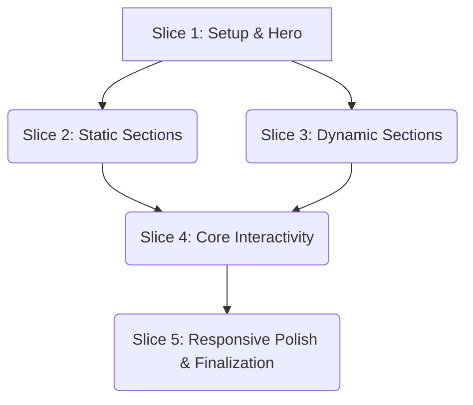

# Rencana Implementasi: Website Portofolio Ryan Fahri Atanto

Rencana ini menggunakan pendekatan *vertical slicing* untuk memastikan setiap fase menghasilkan fungsionalitas yang dapat diverifikasi dan terlihat oleh pengguna.

## Dependency Graph

- **Slice 1** adalah fondasi.
- **Slice 2 & 3** dapat dikerjakan secara paralel setelah Slice 1 selesai.
- **Slice 4** bergantung pada semua section dari Slice 2 & 3 untuk diimplementasikan (untuk scrollspy dan animations).
- **Slice 5** adalah fase final yang memoles keseluruhan website.

---

## ▶️ Slice 1: Foundational Setup & Hero Section

Tujuan: Membuat struktur dasar proyek, styling awal, dan mengimplementasikan section pertama yang paling menonjol (Hero).

| ID | Tugas | Kriteria Penerimaan (Acceptance Criteria) | Langkah Verifikasi (Verification) |
|---|---|---|---|
| **1.1** | **Setup Proyek** | - Struktur folder (`/src`, `/dist`, `/assets`) dibuat.   - `package.json` diinisialisasi.   - `tailwindcss` diinstal.   - Konfigurasi `tailwind.config.js` dibuat dengan tema (warna, font).   - `index.html` dan `src/input.css` dibuat. | `ls -R` menunjukkan struktur direktori yang benar. `cat package.json` menunjukkan `tailwindcss` sebagai dev dependency. `npx tailwindcss -i ./src/input.css -o ./dist/output.css` berhasil membuat `output.css`. |
| **1.2** | **Struktur HTML Dasar & Hero** | - `index.html` memiliki `<head>` (dengan link ke `dist/output.css`) dan `<body>`.   - Section `#hero` ada dengan konten placeholder (nama, title, CTA).   - Latar belakang gelap sesuai palet warna diterapkan pada `<body>`. | Buka `index.html` di browser.   - Latar belakang harus berwarna gelap.   - Teks placeholder dari section Hero terlihat. |
| **1.3** | **Styling Glassmorphism & Hero Card**| - Utility class `.glass` dibuat di `input.css` menggunakan `@layer utilities`.   - Section `#hero` menggunakan style glassmorphism.   - Teks di dalam Hero Card (nama, title) ditata sesuai `PROJECT_DESIGN.md`.   - Tombol CTA ("View My Work", "Contact Me") ditata tetapi belum fungsional. | Buka `index.html` di browser.   - Hero section memiliki efek blur transparan (glass).   - Tipografi dan warna teks sesuai desain.   - Tombol CTA terlihat benar. |

---

## ▶️ Slice 2: Static Content Sections

Tujuan: Menambahkan section-section yang sebagian besar berisi konten statis.

| ID | Tugas | Kriteria Penerimaan (Acceptance Criteria) | Langkah Verifikasi (Verification) |
|---|---|---|---|
| **2.1** | **Implementasi Section "About"** | - Section `#about` ditambahkan di `index.html` setelah `#hero`.   - Menggunakan komponen `.glass-card`.   - Konten dari `/tmp/cv-ryan.txt` dimasukkan. | Buka `index.html`, scroll ke bawah Hero.   - Section "About" terlihat dengan style glass.   - Konten sesuai dengan CV. |
| **2.2** | **Implementasi Section "Education"** | - Section `#education` ditambahkan di `index.html`.   - Menggunakan komponen `.glass-card`.   - Konten (Universitas, Sertifikasi) dari `/tmp/cv-ryan.txt` dimasukkan. | Scroll ke section "Education".   - Section terlihat dengan style glass.   - Konten sesuai dengan CV. |
| **2.3** | **Implementasi Footer & Contact** | - Section `#contact` (sebagai `<footer>`) ditambahkan di akhir.   - Link WhatsApp (`wa.me`) dan Email (`mailto`) fungsional.   - Alamat ditampilkan sebagai teks biasa. | Scroll ke bagian paling bawah.   - Klik link WhatsApp dan Email, pastikan URL benar.   - Alamat terlihat dan tidak bisa diklik. |

---

## ▶️ Slice 3: Dynamic & Interactive Sections

Tujuan: Membangun section dengan layout yang lebih kompleks dan interaktivitas awal.

| ID | Tugas | Kriteria Penerimaan (Acceptance Criteria) | Langkah Verifikasi (Verification) |
|---|---|---|---|
| **3.1** | **Implementasi Section "Experience"** | - Section `#experience` ditambahkan di `index.html`.   - Membuat layout timeline vertikal.   - Setiap item pengalaman kerja adalah sebuah `.glass-card`.   - Konten (perusahaan, jabatan, tanggal) dari `/tmp/cv-ryan.txt` dimasukkan. | Scroll ke section "Experience".   - Tampilan menyerupai timeline.   - Semua data pengalaman kerja dari CV ada dan akurat. |
| **3.2** | **Implementasi Section "Skills"** | - Section `#skills` ditambahkan di `index.html`.   - Setiap skill dari `/tmp/cv-ryan.txt` ditampilkan sebagai "chip".   - Chip memiliki style dasar dan efek `hover` (glow) menggunakan CSS transition. | Scroll ke section "Skills".   - Semua skill dari CV ditampilkan sebagai chip.   - Arahkan kursor ke setiap chip, pastikan efek glow muncul. |

---

## ▶️ Slice 4: Core Interactivity & Animations

Tujuan: Menghidupkan website dengan fungsionalitas JavaScript utama.

| ID | Tugas | Kriteria Penerimaan (Acceptance Criteria) | Langkah Verifikasi (Verification) |
|---|---|---|---|
| **4.1** | **Implementasi Navbar & Scrollspy** | - `src/main.js` dibuat dan di-link di `index.html`.   - Navbar sticky dengan style glassmorphism dibuat.   - IntersectionObserver digunakan untuk mendeteksi section aktif.   - Link di navbar mendapat `active class` saat section-nya di-scroll.   - Klik link di navbar melakukan smooth scroll ke section yang sesuai. | - Scroll halaman ke bawah, navbar harus tetap di atas.   - Saat scroll, link navigasi yang aktif berubah sesuai section yang terlihat.   - Klik setiap link di navbar, halaman harus scroll dengan mulus ke section tersebut. |
| **4.2** | **Implementasi Scroll-Reveal Animations** | - Logika IntersectionObserver di `main.js` diperluas.   - Setiap section (`<section>`) diberi class `.hidden-section` secara default (mis: `opacity-0 translate-y-10`).   - Saat section masuk viewport, class diubah untuk memicu transisi CSS (fade-in + slide-up).   - Animasi harus bisa diputar ulang (re-triggerable). | - Refresh halaman, scroll ke bawah perlahan.   - Setiap section harus muncul dengan animasi fade-in dan slide-up.   - Scroll ke atas melewati section, lalu scroll ke bawah lagi. Animasi harus terulang. |
| **4.3** | **Fungsionalitas Hero CTAs** | - Event listener ditambahkan ke tombol CTA di section Hero.   - Tombol "View My Work" melakukan smooth scroll ke `#experience`.   - Tombol "Contact Me" melakukan smooth scroll ke `#contact`. | - Klik tombol "View My Work", pastikan scroll ke section Experience.   - Klik tombol "Contact Me", pastikan scroll ke Footer. |

---

## ▶️ Slice 5: Responsive Polish & Finalization

Tujuan: Memastikan website bekerja sempurna di semua perangkat dan melakukan verifikasi akhir.

| ID | Tugas | Kriteria Penerimaan (Acceptance Criteria) | Langkah Verifikasi (Verification) |
|---|---|---|---|
| **5.1** | **Implementasi Hamburger Menu (Mobile)** | - Tampilan navbar berubah di breakpoint mobile (mis: `< 768px`).   - Ikon hamburger ditampilkan, link navigasi horizontal disembunyikan.   - Klik ikon hamburger akan menampilkan/menyembunyikan menu navigasi vertikal. | Buka DevTools, set lebar viewport ke 320px.   - Navbar harus menampilkan ikon hamburger.   - Klik ikon tersebut untuk membuka dan menutup menu. |
| **5.2** | **Refinement Responsive Layout** | - Semua section (Hero, About, Experience, Skills, Education, Contact) ditata dengan benar di breakpoint 320px, 768px, 1024px, 1440px.   - Tidak ada horizontal scroll yang tidak diinginkan.   - Ukuran font dan padding disesuaikan per breakpoint. | Gunakan DevTools Responsive Mode.   - Periksa setiap section di keempat breakpoint.   - Pastikan layout tidak rusak dan konten tetap terbaca dengan baik. |
| **5.3** | **Final Validation & Performance Check** | - `npx html-validate index.html` berjalan tanpa error.   - Periksa LCP (< 2.5s) dan FPS (60fps) menggunakan DevTools Lighthouse/Performance.   - Lakukan pengecekan manual terakhir terhadap semua fungsionalitas (link, animasi, scrollspy, responsive). | - Jalankan `html-validate` di terminal.   - Buka tab Lighthouse/Performance di DevTools dan jalankan audit.   - Lakukan QA manual dari awal hingga akhir seperti pengguna baru. |
